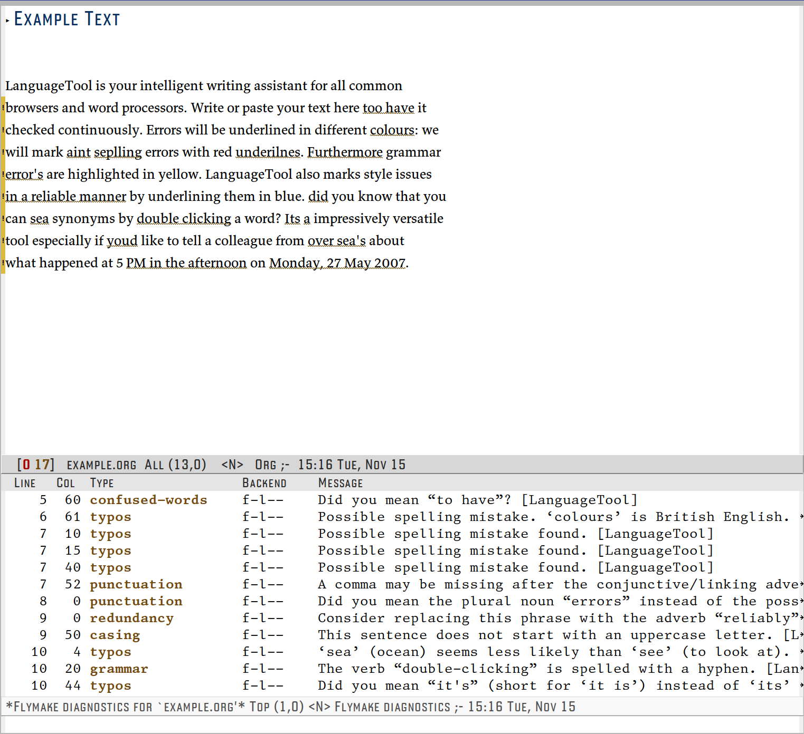

[](https://www.gnu.org/licenses/gpl-3.0)
[](https://melpa.org/#/flymake-languagetool)
[](https://stable.melpa.org/#/flymake-languagetool)


# flymake-languagetool

> Flymake support for LanguageTool.

[](https://github.com/emacs-languagetool/flymake-languagetool/actions/workflows/test.yml)

## 💾 Installation

The instruction to use this plugin.

1. **For a Local Server:** Download LanguageTool from https://languagetool.org/download/ and
   extract on to your local machine.
   **For a Remote Server:** If you are using LanguageTool's API and have a premium
   account you will need your username and an api key you can generate
   here https://languagetool.org/editor/settings/access-tokens
2. Consider adding one of the following snippets to your configuration.

#### Local LanguageTool Server

```el
(use-package flymake-languagetool
  :ensure t
  :hook ((text-mode       . flymake-languagetool-load)
         (latex-mode      . flymake-languagetool-load)
         (org-mode        . flymake-languagetool-load)
         (markdown-mode   . flymake-languagetool-load))
  :init
  ;; Local Server Configuration
  (setq flymake-languagetool-server-jar
	"path/to/LanguageTool-X.X/languagetool-server.jar"))
```

#### Free LanguageTool Account

```el
(use-package flymake-languagetool
  :ensure t
  :hook ((text-mode       . flymake-languagetool-load)
         (latex-mode      . flymake-languagetool-load)
         (org-mode        . flymake-languagetool-load)
         (markdown-mode   . flymake-languagetool-load))
  :init
  ;; LanguageTools API Remote Server Configuration
  (setq flymake-languagetool-server-jar nil)
  (setq flymake-languagetool-url "https://api.languagetool.org"))
```

#### Premium LanguageTool Account

```el
(use-package flymake-languagetool
  :ensure t
  :hook ((text-mode       . flymake-languagetool-load)
         (latex-mode      . flymake-languagetool-load)
         (org-mode        . flymake-languagetool-load)
         (markdown-mode   . flymake-languagetool-load))
  :init
  ;; If using Premium Version provide the following information
  (setq flymake-languagetool-server-jar nil)
  (setq flymake-languagetool-url "https://api.languagetoolplus.com")
  (setq flymake-languagetool-api-username "myusername")
  (setq flymake-languagetool-api-key "APIKEY"))
```

3. :tada: Done! Now open a text file and hit `M-x flymake-mode`!

Another option is to add `flymake-languagetool-maybe-load` to
`find-file-hook`, this way `flymake-languagetool` will be enabled
whenever `flymake-mode` is active and the current major-mode is
included in `flymake-languagetool-active-modes`.

```el
(add-hook 'find-file-hook 'flymake-languagetool-maybe-load)
```

## 🧪 Configuration

### Sentence Awareness

`flymake-languagetool` now uses emacs sentence navigation to send only portions
of the text that have been modified rather than the entire buffer. In order for
this to behave in an expected manner, you may have to modify
`sentence-end-double-space`. The default is set to `true` and may cause some
contextual issues if you only use a single space to separate sentences.

### Language

The language used for flymake can be customized by using
`flymake-languagetool-language` (Default `"en-US"`)

### Active Modes

If you are using `flymake-languagetool-maybe-load` you can customize
which modes `flymake-languagetool` will be enabled for by adding a
major-mode to `flymake-languagetool-active-modes`. The default value
is `'(text-mode latex-mode org-mode markdown-mode message-mode)`

### Spellchecking

LanguageTool’s spellchecking is disabled by default. If
`flymake-languagetool-check-spelling` is non-nil LanguageTool will check
for spelling mistakes.

### Disabling Rules & Categories

Specific rules can be disabled using
`flymake-languagetool-disabled-rules`. For example, LanguageTool's
whitespace rule can be a bit verbose in `org-mode` and it can be
disabled by adding its ID to this variable.

```el
(push "WHITESPACE_RULE" flymake-languagetool--disabled-rules)
```

The full list of rules and their IDs can be found [here](https://community.languagetool.org/rule/list?lang=en).

Similarly, you can disable categories using the
`flymake-languagetool-disabled-categories` variable. The full list of
categories can be found in `flymake-languagetool-map`

You can also disable rules and categories interactively with the `Ignore`
option. These rules will be ignored temporarily, for the current buffer
only.

### Corrections

Suggestions from LanguageTool can be applied with:

`flymake-languagetool-correct`: select error in current buffer with
    completing read

`flymake-languagetool-correct-at-point`: correct error at point

`flymake-languagetool-correct-dwim`: if point is on a
    `flymake-languagetool` error then correct; otherwise, select one
    from the current buffer.

### Categories

By default, `flymake-languagetool` will now provide LanguageTool
category information for each identified error. If you wish to disable
this behavior, you can set `flymake-languagetool-use-categories = nil`.



## 🛠️ Contribute

[](http://makeapullrequest.com)
[](https://github.com/bbatsov/emacs-lisp-style-guide)
[](https://www.paypal.me/jcs090218)
[](https://www.patreon.com/jcs090218)

If you would like to contribute to this project, you may either
clone and make pull requests to this repository. Or you can
clone the project and establish your own branch of this tool.
Any methods are welcome!

### 🔬 Development

To run the test locally, you will need the following tools:

- [Eask](https://emacs-eask.github.io/)
- [Make](https://www.gnu.org/software/make/) (optional)

Install all dependencies and development dependencies:

```sh
eask install-deps --dev
```

To test the package's installation:

```sh
eask package
eask install
```

To test compilation:

```sh
eask compile
```

**🪧 The following steps are optional, but we recommend you follow these lint results!**

The built-in `checkdoc` linter:

```sh
eask lint checkdoc
```

The standard `package` linter:

```sh
eask lint package
```

*📝 P.S. For more information, find the Eask manual at https://emacs-eask.github.io/.*

## ⚜️ License

This program is free software; you can redistribute it and/or modify
it under the terms of the GNU General Public License as published by
the Free Software Foundation, either version 3 of the License, or
(at your option) any later version.

This program is distributed in the hope that it will be useful,
but WITHOUT ANY WARRANTY; without even the implied warranty of
MERCHANTABILITY or FITNESS FOR A PARTICULAR PURPOSE.  See the
GNU General Public License for more details.

You should have received a copy of the GNU General Public License
along with this program.  If not, see <https://www.gnu.org/licenses/>.

See [`LICENSE`](./LICENSE.txt) for details.
